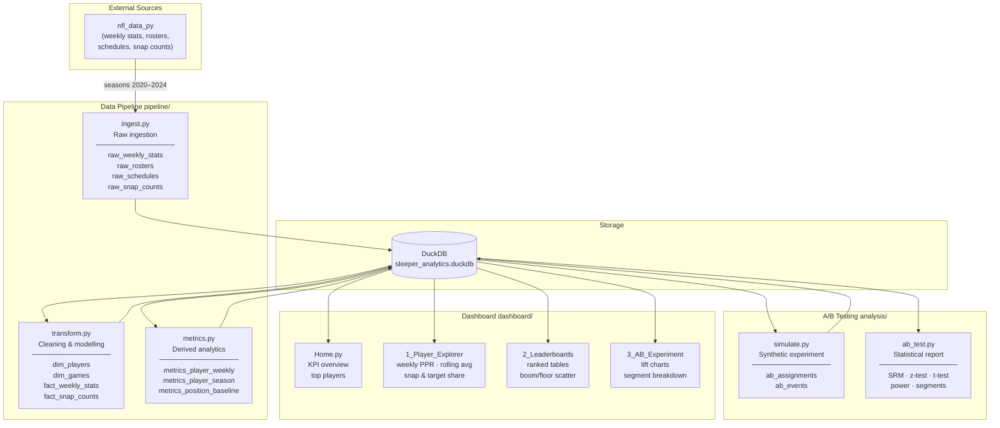

# Architecture

```mermaid
flowchart TD
    subgraph Sources["External Sources"]
        NFL["nfl_data_py\n(weekly stats, rosters,\nschedules, snap counts)"]
    end

    subgraph Pipeline["Data Pipeline  pipeline/"]
        ING["ingest.py\nRaw ingestion\n────────────────\nraw_weekly_stats\nraw_rosters\nraw_schedules\nraw_snap_counts"]
        TRF["transform.py\nCleaning & modelling\n────────────────\ndim_players\ndim_games\nfact_weekly_stats\nfact_snap_counts"]
        MET["metrics.py\nDerived analytics\n────────────────\nmetrics_player_weekly\nmetrics_player_season\nmetrics_position_baseline"]
    end

    subgraph Store["Storage"]
        DB[("DuckDB\nsleeper_analytics.duckdb")]
    end

    subgraph Experiment["A/B Testing  analysis/"]
        SIM["simulate.py\nSynthetic experiment\n────────────────\nab_assignments\nab_events"]
        ABT["ab_test.py\nStatistical report\n────────────────\nSRM · z-test · t-test\npower · segments"]
    end

    subgraph Dashboard["Dashboard  dashboard/"]
        HOME["Home.py\nKPI overview\ntop players"]
        PE["1_Player_Explorer\nweekly PPR · rolling avg\nsnap & target share"]
        LB["2_Leaderboards\nranked tables\nboom/floor scatter"]
        AB["3_AB_Experiment\nlift charts\nsegment breakdown"]
    end

    NFL -->|"seasons 2020–2024"| ING
    ING --> DB
    DB  --> TRF
    TRF --> DB
    DB  --> MET
    MET --> DB
    DB  --> SIM
    SIM --> DB
    DB  --> ABT
    DB  --> HOME & PE & LB & AB
```
