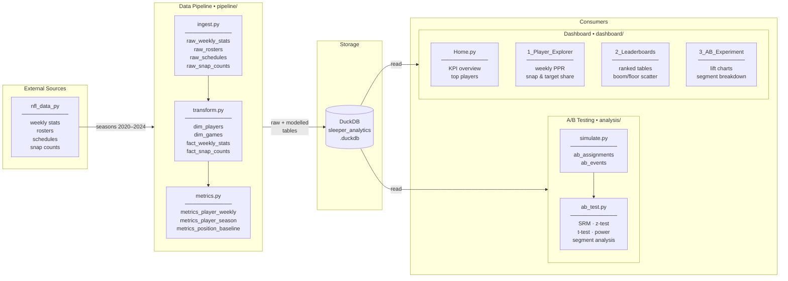

# Architecture

```mermaid
flowchart LR
    subgraph Sources["External Sources"]
        NFL["nfl_data_py\n────────────\nweekly stats\nrosters\nschedules\nsnap counts"]
    end

    subgraph Pipeline["Data Pipeline  •  pipeline/"]
        direction TB
        ING["ingest.py\n────────────\nraw_weekly_stats\nraw_rosters\nraw_schedules\nraw_snap_counts"]
        TRF["transform.py\n────────────\ndim_players\ndim_games\nfact_weekly_stats\nfact_snap_counts"]
        MET["metrics.py\n────────────\nmetrics_player_weekly\nmetrics_player_season\nmetrics_position_baseline"]
        ING --> TRF --> MET
    end

    subgraph Store["Storage"]
        DB[("DuckDB\nsleeper_analytics\n.duckdb")]
    end

    subgraph Consumers["Consumers"]
        direction TB
        subgraph Experiment["A/B Testing  •  analysis/"]
            direction TB
            SIM["simulate.py\n────────────\nab_assignments\nab_events"]
            ABT["ab_test.py\n────────────\nSRM · z-test\nt-test · power\nsegment analysis"]
            SIM --> ABT
        end
        subgraph Dashboard["Dashboard  •  dashboard/"]
            direction TB
            HOME["Home.py\n────────────\nKPI overview\ntop players"]
            PE["1_Player_Explorer\n────────────\nweekly PPR\nsnap & target share"]
            LB["2_Leaderboards\n────────────\nranked tables\nboom/floor scatter"]
            AB["3_AB_Experiment\n────────────\nlift charts\nsegment breakdown"]
        end
    end

    NFL -->|"seasons 2020–2024"| Pipeline
    Pipeline -->|"raw + modelled\ntables"| DB
    DB -->|"read"| Experiment
    DB -->|"read"| Dashboard
```
