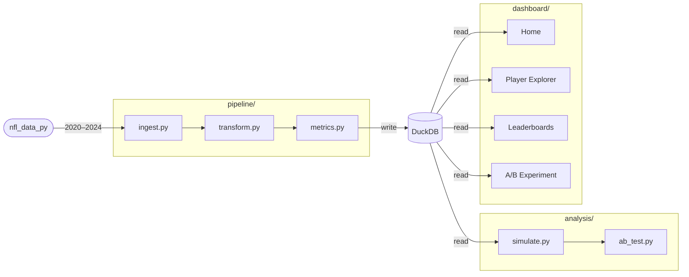

# Architecture

```mermaid
flowchart LR
    NFL(["nfl_data_py"])

    subgraph Pipeline["pipeline/"]
        direction TB
        ING["ingest.py"]
        TRF["transform.py"]
        MET["metrics.py"]
        ING --> TRF --> MET
    end

    DB[("DuckDB")]

    subgraph Analysis["analysis/"]
        direction TB
        SIM["simulate.py"]
        ABT["ab_test.py"]
        SIM --> ABT
    end

    subgraph Dashboard["dashboard/"]
        direction TB
        HOME["Home"]
        PE["Player Explorer"]
        LB["Leaderboards"]
        AB["A/B Experiment"]
    end

    NFL -->|"2020–2024"| ING
    MET -->|"write"| DB
    DB  -->|"read"| SIM
    DB  -->|"read"| HOME
    DB  -->|"read"| PE
    DB  -->|"read"| LB
    DB  -->|"read"| AB
```
