# Sleeper Fantasy Analytics

A full-stack data analytics portfolio project modelled on the responsibilities of a
Product / Data Analyst role at a fantasy-sports platform.

It covers the complete analytics lifecycle: **data pipeline → metrics → A/B testing → interactive dashboard**.

---

## Architecture

```mermaid
flowchart TD
    subgraph Sources["External Sources"]
        NFL["nfl_data_py\n(weekly stats, rosters,\nschedules, snap counts)"]
    end

    subgraph Pipeline["Data Pipeline  pipeline/"]
        ING["ingest.py\nRaw ingestion\n────────────────\nraw_weekly_stats\nraw_rosters\nraw_schedules\nraw_snap_counts"]
        TRF["transform.py\nCleaning & modelling\n────────────────\ndim_players\ndim_games\nfact_weekly_stats\nfact_snap_counts"]
        MET["metrics.py\nDerived analytics\n────────────────\nmetrics_player_weekly\nmetrics_player_season\nmetrics_position_baseline"]
    end

    subgraph Store["Storage"]
        DB[("DuckDB\nsleeper_analytics.duckdb")]
    end

    subgraph Experiment["A/B Testing  analysis/"]
        SIM["simulate.py\nSynthetic experiment\n────────────────\nab_assignments\nab_events"]
        ABT["ab_test.py\nStatistical report\n────────────────\nSRM · z-test · t-test\npower · segments"]
    end

    subgraph Dashboard["Dashboard  dashboard/"]
        HOME["Home.py\nKPI overview\ntop players"]
        PE["1_Player_Explorer\nweekly PPR · rolling avg\nsnap & target share"]
        LB["2_Leaderboards\nranked tables\nboom/floor scatter"]
        AB["3_AB_Experiment\nlift charts\nsegment breakdown"]
    end

    NFL -->|"seasons 2020–2024"| ING
    ING --> DB
    DB  --> TRF
    TRF --> DB
    DB  --> MET
    MET --> DB
    DB  --> SIM
    SIM --> DB
    DB  --> ABT
    DB  --> HOME & PE & LB & AB
```



---

## Project structure

```
sleeper_analytics/
│
├── run.py                        # Full pipeline entry point
│
├── pipeline/
│   ├── ingest.py                 # Raw data ingestion (nfl_data_py → DuckDB)
│   ├── transform.py              # Dimension + fact table construction
│   └── metrics.py                # Derived metrics: rolling avgs, boom/bust, CV
│
├── analysis/
│   ├── simulate.py               # Synthetic A/B experiment data generator
│   └── ab_test.py                # Statistical tests + full report
│
├── dashboard/
│   ├── data.py                   # Cached DuckDB query layer
│   ├── Home.py                   # Streamlit entry point (KPI overview)
│   └── pages/
│       ├── 1_Player_Explorer.py  # Individual player deep-dive
│       ├── 2_Leaderboards.py     # Season rankings by position
│       └── 3_AB_Experiment.py    # Experiment results & lift analysis
│
└── data/
    └── sleeper_analytics.duckdb  # Local analytical store (git-ignored)
```

---

## Quick start

**Requirements:** Python ≥ 3.10, [uv](https://docs.astral.sh/uv/)

```bash
git clone <repo-url>
cd sleeper_analytics

# Install dependencies
uv sync

# Run the full pipeline  (downloads ~5 seasons of NFL data, ~2 min)
uv run python run.py

# Run the A/B experiment simulation + statistical report
uv run python -m analysis.ab_test

# Launch the dashboard
uv run streamlit run dashboard/Home.py
```

Open **http://localhost:8501** in your browser.

---

## Pipeline layers

### 1 · Ingestion (`pipeline/ingest.py`)

Pulls four datasets from `nfl_data_py` for seasons 2020–2024 and loads them
as raw tables into DuckDB with no transformation.

| Raw table | Source | Rows |
|---|---|---|
| `raw_weekly_stats` | `import_weekly_data` | ~28 k |
| `raw_rosters` | `import_weekly_rosters` | ~229 k |
| `raw_schedules` | `import_schedules` | ~1.4 k |
| `raw_snap_counts` | `import_snap_counts` | ~131 k |

### 2 · Transform (`pipeline/transform.py`)

Cleans raw tables into analysis-ready dimensions and facts.
Filters to **skill positions only** (QB, RB, WR, TE) and **regular season**.

| Table | Type | Description |
|---|---|---|
| `dim_players` | Dimension | One row per player, deduplicated by latest roster entry. Includes `sleeper_id`. |
| `dim_games` | Dimension | One row per game with scores, weather, and betting lines. |
| `fact_weekly_stats` | Fact | Weekly performance per player. |
| `fact_snap_counts` | Fact | Offensive snap counts per player per game. |

### 3 · Metrics (`pipeline/metrics.py`)

Computes derived analytics on top of the fact tables.

| Table | Key metrics |
|---|---|
| `metrics_player_weekly` | Efficiency rates (yards/attempt, catch rate, EPA), rolling 4-week PPR avg, snap share, WoW delta, positional rank |
| `metrics_player_season` | Total/avg PPR, boom/bust rates, consistency CV, ceiling, floor, season positional rank |
| `metrics_position_baseline` | Average points for startable players (top 24 QB, 48 RB/WR, 24 TE) per week |

---

## A/B test analysis

**Experiment:** Do AI-powered waiver wire recommendations increase weekly claim rate?

- 10,000 users · 50/50 split · NFL 2023 weeks 3–10
- Synthetic data generated with realistic baseline rates and novelty decay

**Tests run:**

| Test | Method |
|---|---|
| Sample Ratio Mismatch | Chi-square goodness-of-fit |
| Waiver claim rate (primary) | Two-proportion z-test · Wald CI · Cohen's h |
| Claims per user | Welch's t-test · Cohen's d |
| Lineup set rate | Two-proportion z-test |
| Full-season retention | Two-proportion z-test |
| Novelty effect | Week-by-week lift table |
| Segment analysis | Per-segment z-tests (user type, league type) |
| Power analysis | Post-hoc power + MDE |

**Results summary:**

| Metric | Control | Treatment | Lift | Significant |
|---|---|---|---|---|
| Waiver claim rate | 33.1% | 42.0% | +8.9pp (+26.6%) | ✅ |
| Claims per user | 4.78 | 7.36 | +2.58 (+53.8%) | ✅ |
| Lineup set rate | 82.3% | 85.8% | +3.5pp (+4.2%) | ✅ |
| Full-season retention | 14.6% | 19.3% | +4.8pp (+32.7%) | ✅ |

---

## Dashboard pages

| Page | Description |
|---|---|
| 🏈 Home | KPI overview · top-N players by avg PPR/game · position snapshots |
| 🔍 Player Explorer | Weekly PPR bars + rolling avg + positional baseline · snap share · target share |
| 🏆 Leaderboards | Ranked table by position + season · Avg PPR vs Boom Rate scatter · Ceiling vs Floor quadrant |
| ⚗️ A/B Experiment | Lift metric cards · control vs treatment line chart · week-by-week lift · segment bar charts |

---

## Tech stack

| Layer | Tool |
|---|---|
| Data ingestion | `nfl_data_py` |
| Analytical store | DuckDB |
| Data manipulation | pandas |
| Statistical analysis | scipy |
| Dashboard | Streamlit + Plotly |
| Dependency management | uv |
